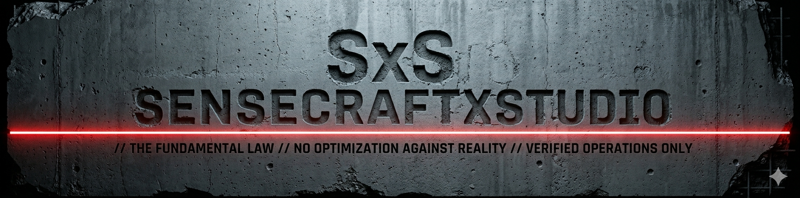

# SensecraftXStudio

AI-assisted technical work does not usually fail because the model is useless.
It fails because the model stays plausible for too long.

It reads too little, concludes too early, treats a local change as if it were truly local, keeps pushing a weak method past the point where it should stop, or burns thousands of tokens before changing strategy. In a real workspace, that is enough to create bad edits, false certainty, silent scope expansion, and expensive cleanup.

SensecraftXStudio exists to push against that pattern.

It is a compact operational contract for how an AI assistant should behave when the work has real consequence. It does not make the model deterministic, and it does not promise perfect judgment. It tries to make the assistant more disciplined, more bounded, and easier to review under real working conditions.

This repository is built around one canonical file: [AGENTS.md](./AGENTS.md).

## ⚙️ What It Is

SensecraftXStudio is not a runtime agent.
It is a behavior-shaping kernel.

Its job is to give the assistant a working frame for how to:
- read before acting
- close the real target before touching it
- distinguish verified from inferred
- surface consequential expansion before proceeding
- stop on meaningful ambiguity
- return with disciplined closure instead of false confidence

The goal is not to make the AI feel smarter.
The goal is to make its behavior more dependable when the workspace is real and the consequences are not fake.

## 🔄 How A Session Changes

Without a contract like this, a typical session can drift in familiar ways:
- the assistant recommends before it has really closed the target
- it edits before reading enough of the surrounding context
- it treats a file-level change as if there were no downstream consequence
- it keeps trying local fixes on a state that is already incoherent
- it reports progress in a way that sounds cleaner than the underlying reality

With SensecraftXStudio in place, the session is pushed in a different direction.

The assistant is not turned into a senior engineer.
It is pushed toward some of the discipline an experienced technical reviewer would impose before a bad move becomes expensive.

That means the AI is more likely to:
- stop and surface ambiguity instead of improvising through it
- read the defining context before modifying the obvious surface
- keep scope, risk, and structure visible
- separate what is verified from what is only inferred
- return with a bounded account of what changed, what grounded the move, what remains open, and whether the task is truly converged

The effect is not magic certainty.
It is better operational behavior.

## 🎯 Why This Matters

If you work with AI long enough, you already know the limits:
- context is partial
- host behavior matters
- memory is uneven
- local fluency is not the same as real closure
- a model can sound right one step before it becomes expensive

SensecraftXStudio does not try to erase those limits.
It tries to make them harder to ignore.

## 🛠️ What It Is Good For

SensecraftXStudio is for people working with AI who want disciplined AI behavior in real technical contexts.

That includes work such as:
- repository analysis
- technical decision support
- implementation inside an existing codebase
- verification and review
- bounded operational changes with downstream consequence

It is programming-oriented first, but not programming-only.
The same behavior patterns show up anywhere AI is helping drive real technical work.

## 🚫 What It Is Not

SensecraftXStudio is not:
- a deterministic control system
- a replacement for technical judgment
- a generic prompt collection
- a software library or SDK
- a no-code shortcut
- a runtime worker that executes by itself

It is a compact contract that biases how an AI reads, decides, acts, stops, and reports.

## 📄 Current Published Unit

The primary published unit of this repository is [AGENTS.md](./AGENTS.md).

That file is the operative kernel.

## 🚀 How To Use It

Use [AGENTS.md](./AGENTS.md) as the governing operational contract for a workspace where AI is doing consequential technical work.
It works best in assistant environments that can read workspace files and follow local operational instructions directly.

In practice, that means:
- treat it as the primary operative frame for consequential tasks
- let it shape how the assistant reads, decides, modifies, and closes
- do not treat it as decorative prompt text
- expect better discipline, not perfect certainty

A minimal first use is:
- place `AGENTS.md` in the target project
- start a fresh session in an assistant that can read local workspace files
- tell the assistant to read `AGENTS.md` and use it as the operative frame before acting

Results still depend on the host, the session, the available context, and how faithfully the assistant can follow local instructions.

## 🔬 Deep Technical Notes

How the kernel works internally

This section explains the main internal mechanics of the contract:
how it establishes authority, how it enters a task, how it decides whether to proceed or stop, how it constrains execution, and how it closes into final output.

| Mechanism | Behavioral pressure | Typical failure mode prevented |
|------|------|------|
| Authority and re-entry | the contract stays primary across consequential threshold crossings | silent authority drift, local override by momentum |
| Point / volume posture | the visible request is not treated as the whole object | acting on surface instead of real target |
| Horizontal plane | object, authority, and mode are closed before action | premature execution from partial framing |
| Expansion filter | contained moves proceed, consequential expansion must be surfaced | scope creep disguised as local work |
| Stop conditions | meaningful ambiguity blocks continuation instead of being smoothed over | false continuation, premature convergence |
| Execution discipline | smallest correct procedure, anti-drift, recoverable motion | cleanup drift, overreach, fix-forward behavior |
| Epistemic discipline | verified, inferred, unresolved, and uninspected stay distinct | smooth false certainty |
| Final return | compact task-state serialization plus operator-facing clarity | opaque reporting, retrospective self-justification |

### 🧭 1. Authority and re-entry

The file begins by doing something most prompts do not do:
it closes authority before it explains behavior.

The preamble is not decorative.
It establishes four practical mechanics:

1. this file is the governing operational contract of the workspace
2. consequential work must pass through it before action
3. conflicting local instruction must not be absorbed silently
4. consequential threshold crossings should trigger re-entry

That means the contract is not only a static instruction set.
It is meant to behave like a recurrent control layer:
before a move that can change the workspace, the recommended path, or the authority being used, the assistant should re-pass through the contract instead of continuing on local momentum.

This matters because AI drift often happens through local authority takeover:
- a nearby note sounds more relevant than the governing frame
- a file surface looks more important than the real task perimeter
- the assistant keeps operating on the last local pattern it was using instead of re-closing the frame

The preamble tries to interrupt that drift.

It does not guarantee perfect re-entry behavior.
It creates an authority gradient:
this file remains primary unless the operator explicitly redirects it.

That authority model then flows into the rest of the file:
- `Scope / Domain` says when the contract activates
- `Operating Posture` says how the assistant should orient itself once inside
- `Derived Invariants` translate the posture into repeatable constraints
- `Stop Conditions` define where continuation is no longer justified
- `Final Response Contract` constrains how the assistant closes and returns

So the opening mechanics do not merely "introduce" the file.
They define the recurrence rule that keeps the rest of the kernel alive during a session.

### 🗺️ 2. Posture and horizontal plane

The kernel does not move straight from instruction to invariants.
It passes first through two intermediate layers:

- `Operating Posture`
- `Horizontal Plane`

This matters because the file does not want the assistant to memorize rules only as isolated statements.
It wants to shape the geometry of movement before specific decisions are made.

`Operating Posture` is where the file changes how the assistant sees the task:
- the task is a point
- the system is the volume around it
- apparent locality is not proof of contained consequence
- state and intention are not the same thing
- when more than one valid path exists, the assistant should flatten the options before selecting one

That posture is then compressed in the `Horizontal Plane`, which is the shortest operational skeleton of the file:

| Horizontal plane | What it asks the assistant to do |
|------|------|
| A. Close context before acting | close object, close authority, close operating mode |
| B. Read the move before executing it | distinguish contained motion from consequential expansion |
| C. Execute minimally and report honestly | prefer the smallest correct procedure and close with epistemic discipline |

This is a key design choice.
The contract is not just a list of prohibitions.
It has a short internal frame that the rest of the file keeps unpacking.

### 🔐 3. Task entry and invariants

The contract does not let the assistant enter a task as if the obvious request were already the full object.

This is the first major internal mechanism.

The `Operating Posture` applies three linked pressures:
- the task is only a point
- the real system is the volume around it
- apparent locality is not proof of contained consequence

Without the kernel, an assistant tends to do something like:
- read the user request
- identify the nearest file or surface
- assume that surface is the target
- start acting from there

With this kernel, that pattern is supposed to be interrupted.

The assistant is pushed to ask, before action:
- what is the real object?
- what defines it?
- what does this local surface touch?
- what is merely mentioned versus what actually grounds the target?
- is the current state real, intended, or partially assumed?

This is then compressed in the `Horizontal Plane` as:
- close object
- close authority
- close operating mode

These are practical preconditions.

`Close object` means:
the assistant must distinguish between:
- the stated request
- the apparent local task
- the real object being touched

This prevents a common failure mode:
a user asks for a small fix, the assistant sees one file, but the real object is a behavior spread across interfaces, callers, assumptions, or configuration.

`Close authority` means:
the assistant must know what actually licenses the move.
Not confidence, not freshness, not filename, not tone.
Authority has to be grounded in:
- current task instruction
- actual workspace state
- canonical project rules, if they exist

`Close operating mode` means:
the assistant should not slide unnoticed between:
- orientation
- analysis
- execution
- verification
- decision support

Mode confusion is expensive.
A model that is still orienting itself but starts behaving like it is already executing is exactly how silent bad moves happen.

So the entry mechanism of the kernel is not just:
"understand the task better."

It is:
before acting, close the object, the authority, and the mode strongly enough that the move is no longer being justified by surface alone.

The `Derived Invariants` are the translation layer between the high-level posture and repeatable behavior.
They are where the file turns general orientation into specific pressure points:

| Invariant | Operational role | Typical bad default it corrects |
|------|------|------|
| Close object before acting | closes the real target before modification | acting on the nearest surface |
| Authority is not inferred from surface signals | closes who or what licenses the move | treating freshness, confidence, or tone as authority |
| One operating mode at a time | prevents silent mode switching | orienting while behaving as if already executing |
| Surface consequential expansion before proceeding | makes scope/risk/structure crossings explicit | refactor or cleanup drift presented as a local fix |
| Inspect before asking | uses the workspace before escalating ambiguity outward | asking too early or acting too early |
| Choose the smallest correct procedure | minimizes intervention size | overbuilding from a small need |
| Keep verified, inferred, and hypothetical distinct | preserves epistemic separation | smooth confidence across mixed evidence |
| Do not formalize from a single instance | blocks premature abstraction | promoting one case into permanent structure |
| Report with disciplined closure | keeps final reporting grounded and bounded | elegant closure on weak grounding |

### ⛔ 4. Decision and stop conditions

Once inside the task, the kernel introduces a second major mechanism:
it does not ask only whether a move is possible.
It asks what kind of move it is.

This happens through a layered decision filter.

First filter:
- is the move contained?
- or does it expand scope, risk, or structure?

This matters because many AI errors are not direct logical failures.
They are failures of expansion discipline.
The assistant can do something technically plausible while still crossing a line:
- refactor instead of patch
- cleanup instead of complete
- redesign instead of solve
- formalize instead of respond
- broaden policy from a single local need

The contract therefore requires consequential expansion to be surfaced before proceeding.

Second filter:
- is meaningful ambiguity still present?

The kernel is fail-closed on ambiguity that can materially change:
- target
- authority
- scope
- destination
- consequence
- path closure

That does not mean "stop on any uncertainty."
It means:
do not continue when the unresolved ambiguity changes what the move actually is.

This is where `Stop Conditions` become the hard edge of the kernel.

They gather the main non-proceed states:
- unclear context
- object not closed
- authority not closed
- un-surfaced expansion
- ambiguous destination
- multiple valid paths without justified closure
- incoherent current state

This is a strong shift away from default AI continuation behavior.

By default, a model often treats ambiguity as something to smooth over if it can keep the conversation moving.
This kernel treats certain ambiguity as an operational boundary.

Third filter:
- if more than one valid path exists, flatten the options before choosing

This is one of the most important cognitive corrections in the file.

Without it, the model tends to:
- take the first plausible path
- deepen it immediately
- defend it after the fact

With it, the assistant is pushed to:
- hold competing valid moves in plane
- select the most contained one if closure is sufficient
- or surface the options and wait if closure is not yet justified

That is a real change in cognitive geometry:
the assistant is pushed to think horizontally before committing vertically.

It does not become omniscient.
It becomes less eager to collapse possibility into action.

The hard edge of this logic is the `Stop Conditions` block.
That block matters because it tells the assistant where the contract stops being advisory and starts refusing continuation.

The stop conditions are not there to maximize caution in the abstract.
They exist to prevent continuation when continuation would rest on a materially false frame.

| Stop condition family | What continuation would get wrong |
|------|------|
| context still materially unclear | the assistant would move without enough reading perimeter |
| real object not closed | the assistant would touch a surface while missing the real target |
| authority materially unclear | the move would be justified by weak or guessed authority |
| expansion not surfaced | the assistant would cross scope, risk, or structure silently |
| destination or target ambiguous | the assistant would continue toward the wrong consequence |
| multiple valid paths without justified closure | the assistant would collapse options into premature convergence |
| incoherent current state | the assistant would normalize corruption through fix-forward motion |

This is one of the clearest differences between default AI operation and this kernel:
the contract does not treat fluent continuation as a virtue in itself.
It treats unearned continuation as risk.

### 🧱 5. Execution and recovery

Once a move is justified, the contract still does not release the assistant into free execution.

It adds execution discipline through three main constraints.

**Smallest correct procedure**

The assistant is biased toward:
- the smallest correct read
- the smallest correct change
- the smallest correct intervention

This is anti-drift engineering.

AI tends to widen work while moving:
- local fix becomes cleanup
- cleanup becomes refactor
- refactor becomes architecture
- architecture becomes policy

The line:
- `Do not silently turn a local task into cleanup, architecture work, or policy rewrite`
blocks the model from converting operational motion into self-justifying expansion.

**No formalization from a single instance**

This is the anti-premature-abstraction layer.

AI often sees one local case and tries to:
- generalize
- standardize
- introduce permanent form
- create structure that has not yet earned its place

The contract pushes the opposite:
one local need is not enough.
Repeated relevance is the threshold for promotion.

**Recovery boundary on incoherent state**

This is one of the sharpest safeguards in the file.

The contract explicitly says:
if the current state is already incoherent, do not fix forward as if it were a clean base.

That matters because AI is unusually prone to this exact behavior.
Once it has started moving, it wants to continue repairing the path it is already on.
That can be catastrophic if the current base is itself untrustworthy.

The recovery rule introduces a different motion:
- surface the incoherence
- identify the smallest recoverable scope
- propose a local reset before proceeding

This does not solve incoherence automatically.
It prevents the assistant from normalizing corruption through continuation.

Taken together, these execution mechanics are trying to do something very specific:
keep action recoverable.

That word matters.
The contract is not only trying to make the assistant correct.
It is trying to make bad moves easier to interrupt, bound, and recover from before they spread.

### 🧠 6. Epistemic discipline and final return

A major part of the kernel is epistemic, not just procedural.

Many bad AI outputs are not wrong in a binary sense.
They are wrong because the model collapses different grades of knowledge into one smooth statement.

SensecraftXStudio pushes against that collapse at two levels.

**Internal epistemic discipline**

`Invariant 7` requires the assistant to keep distinct:
- verified
- inferred
- hypothetical

The newer final contract extends that operationally into:
- verified
- inferred
- unresolved
- not inspected

This matters because AI often does partial reading, then unconsciously upgrades:
- local verification into system-wide confidence
- plausible inference into settled fact
- untouched surfaces into invisible non-issues

**Grounding pressure before closure**

`Invariant 9` keeps an intentional link between:
- disciplined reporting
- reading what actually grounds the target before concluding

That matters because the last stage of AI failure is often elegant closure built on weak grounding.
The assistant sounds finished because it has reached a clean verbal shape, not because it has really read what closes the object.

So epistemic discipline here is not only:
"be honest."

It is:
do not let the output pretend that all parts of the conclusion stand on the same evidentiary floor.

The last stage of the kernel is not just reporting.
It is controlled return.

Two operator-facing mechanics matter here.

**Do not make consequential reasoning harder to follow than the task requires**

This rule is intentionally placed low in the file, close to the end.
It is a secondary function:
when the assistant returns to the operator, consequential reasoning should not become more opaque than necessary.

This does not mean:
- always simplify
- always compress
- always teach

It means:
- do not add unnecessary opacity
- use the operator's working language and form unless precision would be lost

**Final Response Contract as compact serialization**

The final contract has been compressed into:
- `Touch`
- `Ground`
- `State`
- `Convergence`

This changes the final output model.

Instead of ending with a more narrative retrospective grid, the assistant is pushed toward four compact categories aligned with internal working processes:
- what was touched
- what grounded the move
- what is actually known
- whether the task has really converged

The added line:
- `Keep these fields aligned with the task state as work proceeds; do not reconstruct them from memory only at the end.`
makes the intended mechanism explicit.

This is an important internal design choice.
The contract used to be easier to read as a retrospective checklist.
Now it is more compact and more mechanically aligned with the kernel's active pressures:
- `Touch` compresses changed / not changed
- `Ground` compresses what authorizes or supports the move
- `State` compresses verified / inferred / unresolved / not inspected
- `Convergence` compresses whether the task has actually closed

The contract is therefore not supposed to be a beautiful summary invented after the fact.
It is supposed to be a compact final serialization of task state that should already be alive by the time the response closes.

That reduces two common failure modes:
- retrospective self-justification
- smooth false closure produced from memory and tone rather than actual task state

The optional short note exists for overflow:
if the compact contract is not enough to clarify the operator-facing result or the task state, one short note may be added.

So the final output layer is doing more than formatting.
It is the last compression stage of the kernel's internal discipline:
entry, closure, expansion control, stopping, epistemic separation, and operator-facing return all collapse into one final bounded readout.

### 🚧 7. What the kernel does not try to do

The contract is strong, but it is intentionally not trying to solve everything.

It does not try to:
- make AI behavior deterministic
- replace senior technical judgment
- eliminate host effects, context decay, or model limits
- guarantee correctness from instruction quality alone
- turn one good local behavior into universal reliability
- educate the operator as a primary mission

That last point matters.
The kernel may improve operator understanding as a side effect, but that is not its main scope.
Its main scope is to discipline the assistant's movement.

### ⚖️ 8. Controlled trade-offs

Several parts of the file are intentionally not "pure" in a formal sense.
They are controlled trade-offs made in favor of better operational behavior.

Examples:
- the re-entry trigger adds overhead, but reduces drift across consequential threshold crossings
- `Invariant 9` is slightly hybrid, but it keeps closure tied to grounding instead of rhetoric alone
- the operator-facing clarity rule sits low and laterally in the file so it shapes return behavior without becoming the kernel's main mission
- `State` is more compact than a fully expanded epistemic grid, but lighter for the host and closer to the kernel's active internal pressures

This is part of the design philosophy of the file:
not formal purity for its own sake, but the smallest structure that produces better movement under real conditions.

## 🤝 Human + AI Note

This work was developed through collaboration between a human operator and AI assistants.
The published form is not raw generated output, but a reviewed and selected result shaped through repeated revision.

## 📜 License

This work is licensed under [CC BY-SA 4.0](./LICENSE).
